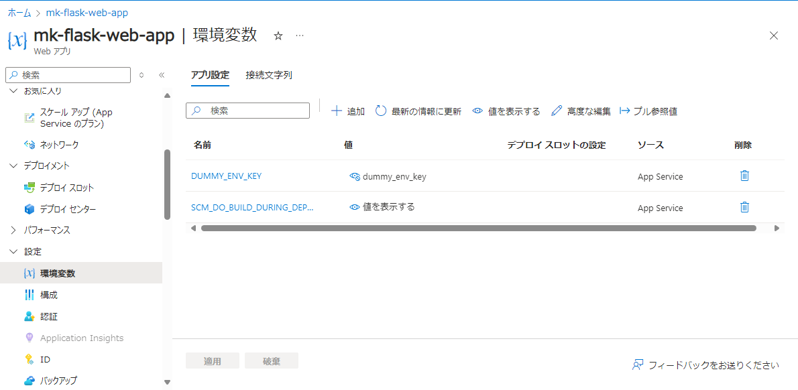
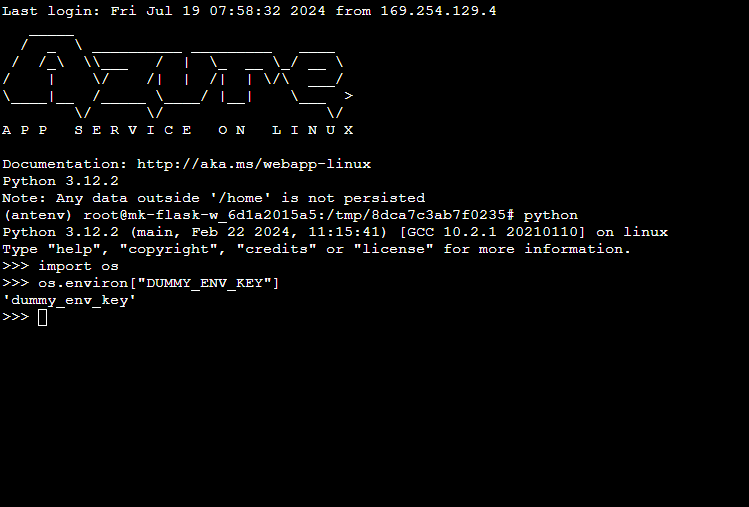

# API_keyについて

- フロントアプリでAPI keyを保持せずに受け渡す方法についてまとめる

## 目次

- [API\_keyについて](#api_keyについて)
  - [目次](#目次)
  - [概要](#概要)
  - [方法](#方法)
    - [環境変数を利用してAPIキーを保存](#環境変数を利用してapiキーを保存)

## 概要

- 現在実装したアプリでは、APIのkeyを直接記載している
- セキュリティ上好ましくないため、別の方法でAPIキーを保管する方法についてまとめる

現在のコード

```py
@app.route('/get_current_data')
def get_current_data():
    api_key = "JVjsDSgHReooM0RZ1U6STsmrQIwIPDoAv4ByC4L-vAXyAzFu6MvXDQ%3D%3D"  # ★実際のAPIキー
    url = f"https://jbsmkfunctionapp.azurewebsites.net/api/get_current_data?code={api_key}"
    response = requests.get(
        url
    )

    return jsonify(response.json())
```

## 方法

- 環境変数を利用してAPIキーを保存する


### 環境変数を利用してAPIキーを保存

pythonでの場合

1. Azure Portalより環境変数を設定

2. pythonの標準ライブラリの機能`os.environ`から取得できることを確認。下記画像は環境変数を設定したApp ServiceのSSH上で実行したpythonコード。


環境変数`DUMMY_ENV_KEY`を取得する場合のpythonコード

```py
import os

print(os.environ["DUMMY_ENV_KEY"])  # 出力: "dummy_env_key" (設定した環境変数の値)
```
