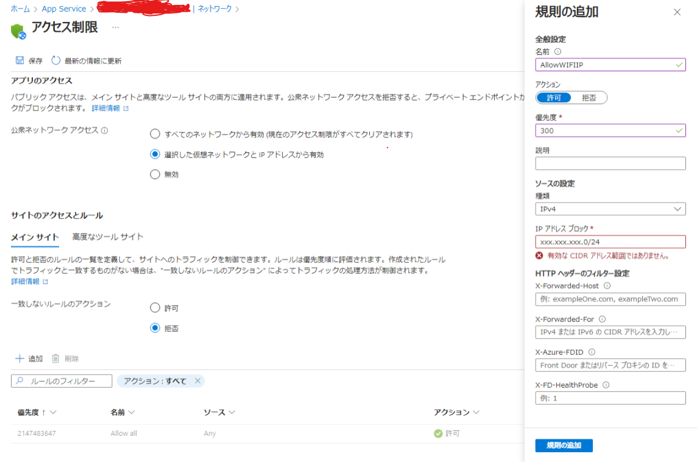

# Terraformについて

- Azureのリソース情報を管理する方法としてTerraformを用いるときの手順や方法についてまとめたもの

## 目次

- [Terraformについて](#terraformについて)
  - [目次](#目次)
  - [参考](#参考)
  - [概要](#概要)
  - [インストール](#インストール)
  - [TerraFormテンプレートの記載](#terraformテンプレートの記載)
  - [Terraformの書き方について](#terraformの書き方について)
  - [TerraFormコードの実行](#terraformコードの実行)
  - [アクセス制限の設定](#アクセス制限の設定)
    - [やりたいこと](#やりたいこと)
    - [手順](#手順)

## 参考

- MSドキュメント: https://learn.microsoft.com/ja-jp/azure/app-service/provision-resource-terraform
- Terraformの構築: https://zenn.dev/yupon55/articles/d4d0c10634fb5d
- terraformの設定: https://registry.terraform.io/providers/hashicorp/azurerm/latest/docs/resources/function_app
- vnet: https://learn.microsoft.com/ja-jp/azure/developer/terraform/hub-spoke-on-prem
- static_web_appのデプロイ: https://zenn.dev/dzeyelid/articles/9ab7b020fd774c212344
- function appのvnet統合: https://zenn.dev/pinter/articles/20230901functionsvnet

## 概要

- クラウドインフラの設定をコードで書きそのコードからインフラ構築・削除・編集など行う事のできる機能
- Azureに限らずAWSやGCPなどでも使える
- 基本的な書き方としてはプロバイダ、リソース名を指定してそこに必要な設定を記載していくような形
  - 変数設定や動的処理を書くことも可能

## インストール

- 実行前にTerraformをOSにinstallが必要
- ubuntuのコンテナ環境でのinstall方法

```bash
$ wget -O- https://apt.releases.hashicorp.com/gpg | sudo gpg --dearmor -o /usr/share/keyrings/hashicorp-archive-keyring.gpg
$ echo "deb [signed-by=/usr/share/keyrings/hashicorp-archive-keyring.gpg] https://apt.releases.hashicorp.com $(lsb_release -cs) main" | sudo tee /etc/apt/sources.list.d/ hashicorp.list
$ sudo apt update && sudo apt install terraform
```

## TerraFormテンプレートの記載

ディレクトリ構成

```bash
.
├── main.tf            # tfファイル全体の設定
├── variables.tf       # 変数をまとめたもの
├── random.tf          # 乱数
├── resource_groups.tf # リソースグループの設定
├── service_plans.tf   # サービスプラン(料金設定)
├── web_app.tf         # AppService(flaskウェブアプリ)の設定
├── function_app.tf    # Function App(API)の設定
└── source_control.tf  # ソースコントロール(デプロイ)の設定

```

## Terraformの書き方について

- 詳細は参考元を参照
- AppServiceの構築を行う場合の例を記載

``` bash
provider "azurerm" {
  features {}
}

# ロケーションの変数化
variable "location" {
  description = "The Azure region where resources will be created"
  default     = "japaneast"
}

# リソースの重複を防ぐための乱数
resource "random_integer" "ri" {
  min = 10000
  max = 99999
}

# リソースグループの設定
resource "azurerm_resource_group" "rg" {
  name     = "mk-flask-appservice-rg-${random_integer.ri.result}"
  location = var.location
}

# AppServiceにつかう料金プランの設定
resource "azurerm_service_plan" "app_service_plan" {
  name                = "mk-flask-app-service-plan-${random_integer.ri.result}"
  location            = azurerm_resource_group.rg.location
  resource_group_name = azurerm_resource_group.rg.name
  os_type             = "Linux"
  sku_name            = "F1"
}

# AppServiceリソースの設定
resource "azurerm_linux_web_app" "webapp" {
  name                  = "mk-flask-webapp-${random_integer.ri.result}"
  location              = azurerm_resource_group.rg.location
  resource_group_name   = azurerm_resource_group.rg.name
  service_plan_id       = azurerm_service_plan.app_service_plan.id
  https_only            = true
  site_config { 
    minimum_tls_version = "1.2"
    always_on           = false  # freeプランの場合必要
    application_stack {
      # ランタイムスタックの指定
      python_version = "3.12"
    }
  }
  app_settings = {
    # 環境変数の設定
    "FUNCTION_APP_API_KEY" = "ANY_API_KEY"name
  }
}

# AppServiceのデプロイ設定
resource "azurerm_app_service_source_control" "sourcecontrol" {
  app_id             = azurerm_linux_web_app.webapp.id
  repo_url           = "https://github.com/anyUser/anyRepo"
  branch             = "anyBranch"
  use_manual_integration = true
  use_mercurial      = false
}
```

## TerraFormコードの実行

```bash
# main.tfがあるディレクトリで実行
$ terraform init
$ terraform plan
$ terraform apply # 入力を求められたときに"yes"を入力
```

## アクセス制限の設定

### やりたいこと

- 管理画面のアクセス制限として社内Wi-FiのIPのみ許可、それ以外のアクセスを拒否するようにしたい
- AzurePortalから設定したときはAppServiceのネットワークのタブから実行
  - `受信トラフィックの構成`→`公衆ネットワーク アクセス` で移動したページで以下のように変更
    - 公衆ネットワーク アクセス: 選択した仮想ネットワークとIPアドレスから有効
    - 一致しないルールのアクション: 拒否
    - ルールの追加→ソースの設定: IPv4, IPアドレスブロック: (許可するWiFiのグローバルIPブロック)

手順で設定した例



### 手順

- (参考)https://registry.terraform.io/providers/hashicorp/azurerm/latest/docs/resources/app_service
- web appのsite_configにip_restrictionのブロックを追加し、設定値をまとめる。


docs/Azureアプリ学習内容/Terraform/work/web_app.tf

```bash
(略)
 site_config { 
    }
    ip_restriction {
      name       = "AllowWiFiIP"
      ip_address = "xxx.xxx.xxx.0/24"
      action     = "Allow"
      priority   = 100
    }
    ip_restriction_default_action = "Deny"
  }
(略)
```